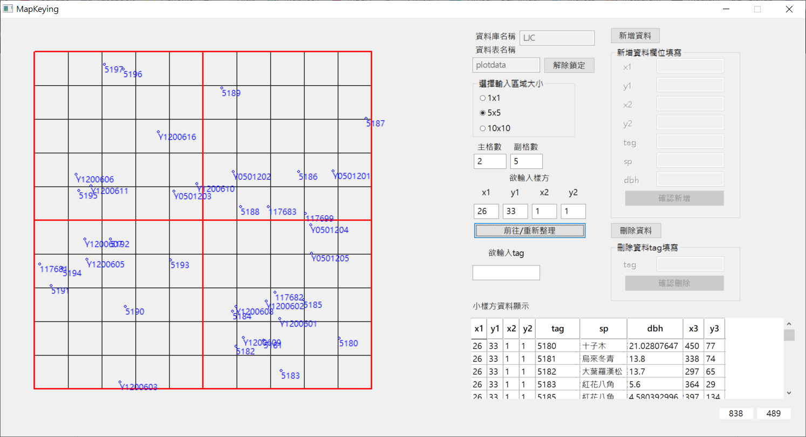

# 植株座標輸入程式  
 
* 這是一個用來輸入植株座標的程式，需要搭配PostgreSQL使用，利用Python撰寫  
* [Windows平台載點](https://github.com/leeyaowen/Mapkeying_python/releases)  

## PostgreSQL資料庫建立(搭配pgAdmin使用)
1. 伺服器選擇預設
2. 密碼設定為2717484
3. 建立一資料庫**自行設定名稱**
4. 建立一關聯表**自行設定名稱**(以下假設為plotdata)
5. 設定欄位屬性，包含**x1,y1,x2,y2,tag,sp,dbh,x3,y3**共9個欄位，除dbh設定為numeric，其餘皆為text  
6. 至Constraints設定tag為primary key(不可為空值且不可有重複值)
7. 匯入資料(使用csv檔須先轉為UTF-8編碼)(將csv檔以記事本開啟另存新檔，編碼改為UTF-8，直接存檔然後匯入)

### 資料庫欄位說明
* x1,y1,x2,y2 -> 樣方代號
* tag -> 植株編號
* sp -> 物種名稱
* dbh -> 胸高直徑
* x3,y3 -> 要輸入的植株位置，由程式記錄

### 資料庫常用基本語法(SQL)
> 於SQL Eidtor內輸入
>> `select * from plotdata` -> 選取plotdata關聯表內的所有資料  
>> `select * from plotdata where x3 is null` -> 選取plotdata內x3為空值的資料

## 程式操作要點  
1. 程式開啟後務必先輸入欲輸入的資料庫與關聯表名稱，並按下鎖定按鈕  
2. 選擇輸入區域的大小(單位為公尺)    
3. 鍵入主格與副格數，常用的組合有(1,5)/(2,5)/(3,3)等，可依需求調整  
4. 設定格線後前往欲輸入的(小)樣方  
5. 點下植株座標位置，若想要微調只要再點一次即可，點按重新整理按鍵即會刷新頁面，保存最後點下的位置  
6. 新增刪除務必填寫正確資料  

### 程式截圖  

